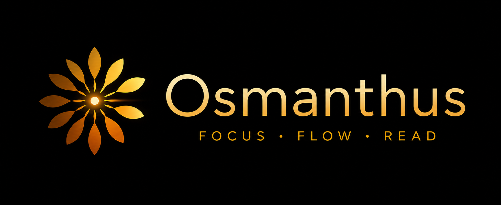

# Osmanthus

**A desktop RSVP speed-reader for epub files.**




---

## What is RSVP?

Rapid Serial Visual Presentation (RSVP) flashes one word at a time in a fixed spot on screen. This eliminates the saccadic eye-movement — the time your eye spends jumping between words — which is the main speed bottleneck in conventional reading.

Osmanthus also uses the **Optimal Recognition Point (ORP)**: the letter ~30% into each word where the brain recognises it fastest. That letter is highlighted in red and aligned to a fixed horizontal column so your eye never drifts.

---

## Features

- **ORP highlighting** — the recognition-point letter is coloured red and horizontally locked
- **Adjustable WPM** — 60–1500 words per minute; fine-tune with keyboard shortcuts
- **Epub import** — drag & drop or file picker; covers, titles, and authors extracted automatically
- **Table of contents** — browse and jump to any chapter by header; navigate with ↑ ↓ Enter (H)
- **Paragraph context** — see the current and previous paragraphs at any time (P)
- **Zen mode** — hide all chrome for distraction-free reading (Z)
- **Fullscreen** — native macOS fullscreen (F)
- **Font scaling** — resize the word display from 0.5× to 3× ([ ])
- **Undo history** — step back through scrubber drags, TOC jumps, and word skips (⌘Z)
- **Command palette** — search and open any book instantly from anywhere (⌘K)
- **Ramp-up mode** — gradually accelerates from 50% to full WPM over 5 seconds on play (above 500 WPM)
- **Reading timer** — set a countdown in seconds; ticks down in real time, pauses automatically when it expires (T)
- **Auto-save** — progress is saved every 25 words and on exit
- **Dark / light mode** — follows your system preference; toggle manually with D

---

## Download

Grab the latest `.dmg` from [**Releases**](https://github.com/msmur/osmanthus/releases/latest).

> **macOS note:** Osmanthus is unsigned. On first launch, right-click the app → **Open** to bypass Gatekeeper.
>
> Two builds are available: `aarch64` (Apple Silicon) and `x86_64` (Intel).

---

## Keyboard shortcuts

### Library

| Key       | Action                   |
|-----------|--------------------------|
| `N`       | Add book                 |
| `↑ ↓ ← →` | Navigate books           |
| `↵`       | Open selected book       |
| `⌘⌫`      | Remove selected book     |
| `⌘K`      | Search books             |
| `D`       | Toggle dark / light mode |
| `I`       | About                    |
| `/`       | Keyboard shortcuts       |

### Reader

| Key       | Action                                    |
|-----------|-------------------------------------------|
| `Space`   | Play / pause                              |
| `← →`     | Skip ±10 words                            |
| `⇧← ⇧→`   | Skip ±50 words                            |
| `↑ ↓`     | Speed ±20 wpm                             |
| `⌘⇧← ⌘⇧→` | Previous / next paragraph                 |
| `C`       | Toggle context words                      |
| `N`       | Toggle navbar                             |
| `X`       | Toggle player controls                    |
| `[ ]`     | Font size −/+                             |
| `P`       | Paragraph view                            |
| `H`       | Headers / table of contents (↑ ↓ Enter)   |
| `Z`       | Zen mode                                  |
| `F`       | Toggle fullscreen                         |
| `G`       | Go to word #                              |
| `W`       | Set WPM                                   |
| `S`       | Set font size                             |
| `R`       | Toggle ramp-up (WPM > 500 only)           |
| `T`       | Set reading timer                         |
| `U`       | Toggle undo history                       |
| `⌘Z`      | Undo word index change                    |
| `⌘K`      | Search books                              |
| `D`       | Toggle dark / light mode                  |
| `I`       | About                                     |
| `L`       | Go to library                             |
| `Esc`     | Exit fullscreen                           |
| `/`       | Keyboard shortcuts                        |

---

## Build from source

**Prerequisites:** Rust, Node.js 18+, pnpm — see [`SETUP.md`](SETUP.md) for full instructions.

```bash
pnpm install
pnpm tauri build
# Output: src-tauri/target/release/bundle/macos/Osmanthus.app
```

For a specific architecture:

```bash
pnpm tauri build --target aarch64-apple-darwin   # Apple Silicon
pnpm tauri build --target x86_64-apple-darwin    # Intel
```

---

## Planned features

- [ ] An android build!

Yep that's all I'm planning for now lol.

---

## Contributing

> **Note:** This codebase was written primarily with the assistance of large language models (Claude).
> It is functional and tested, but has not yet been fully audited or refactored by a human contributor. 
> It is currently in **beta** while I build a deeper understanding of the internals.
>
> If you want to contribute or understand how everything fits together before diving in, see [`INTERNALS.md`](INTERNALS.md) —
> It documents the tech stack with learning resources, maps every feature to its source files and line numbers.
> It calls out the patterns most likely to bite you. 

The LLM-oriented codebase guide is in [`CLAUDE.md`](CLAUDE.md).

My personal progress on understanding what I've built is in [`INTERNALS.md`](INTERNALS.md)

Issues are welcome! At the moment PRs are not. 
Since this code was heavily AI generated I don't think I understand it well enough to take contributions.
This will hopefully change at some point in the future :)

---

## License

MIT — see [`LICENSE`](LICENSE).
